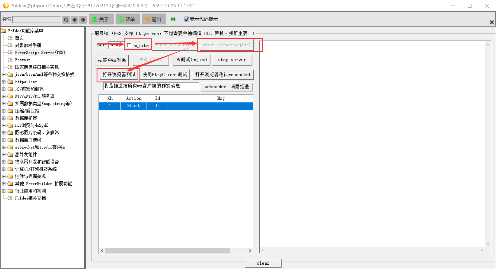
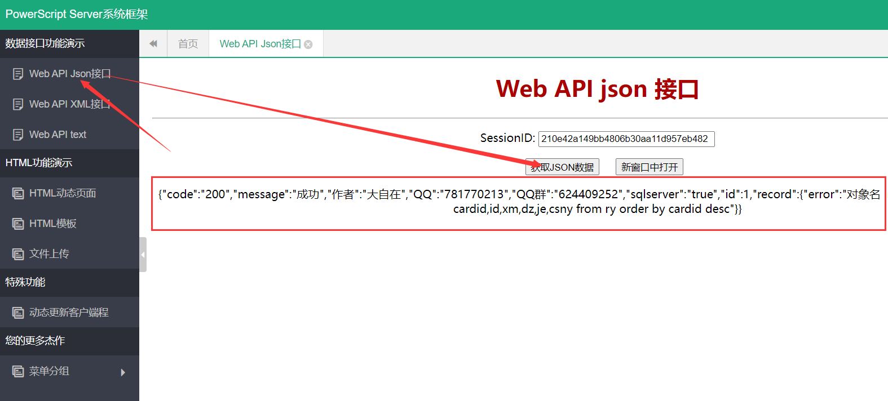
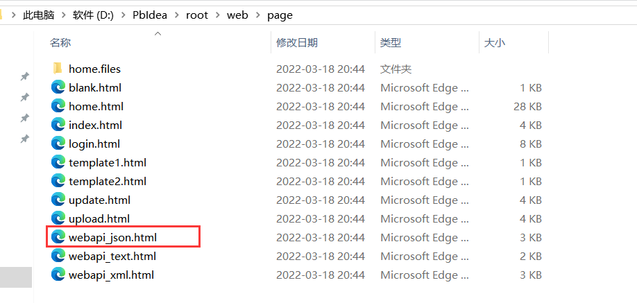
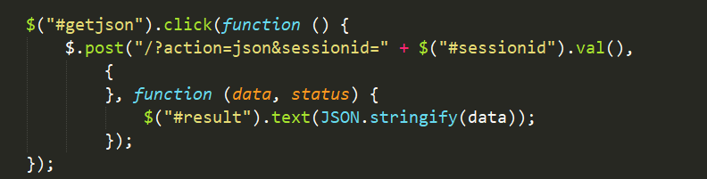
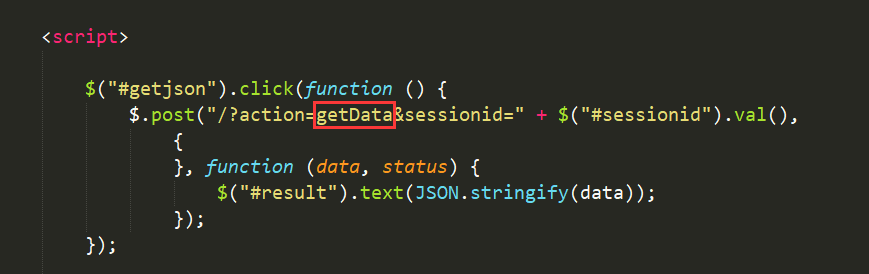
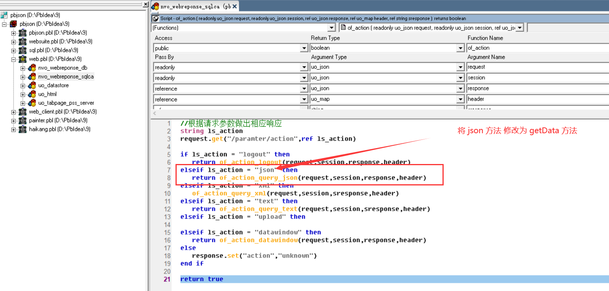
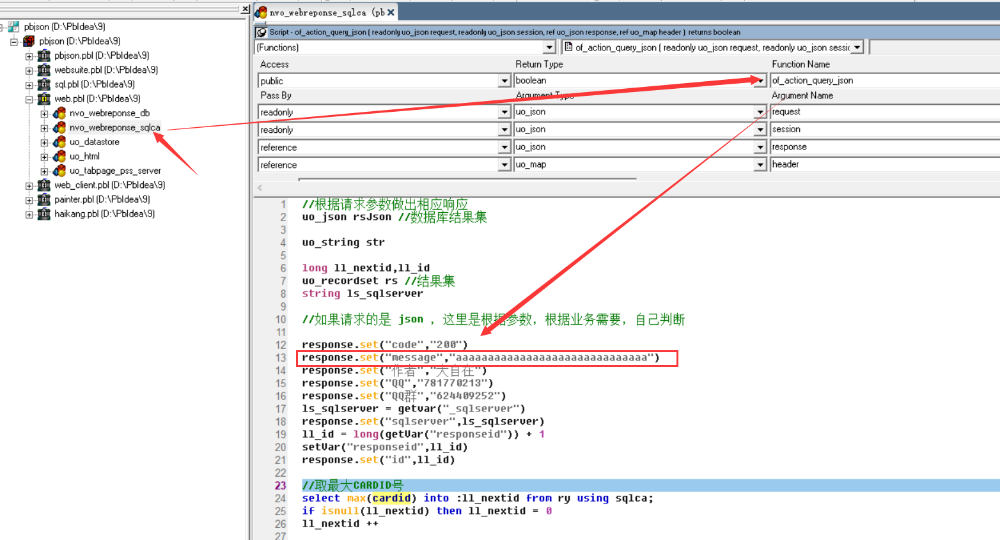
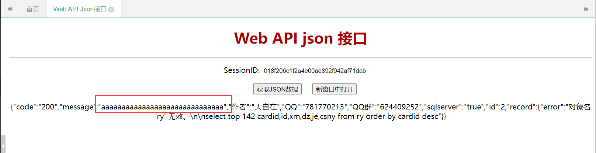

# PSS

## 1、PSS 能干什么？

它同时支持web server 和 websocket server。只要你会写PB程序，就可以使用 websuite 套件，用你的PB代码(PowerScript)轻松写出你的websocket server或 web server。只要有PowerBuilder就行，不再需要考虑IIS、布署、C#、JAVA这些伤脑筋的东西，仅仅PB，就能搞定一切。

## 2、PSS 如何布署？

想多了，不需要你想的那些布署。

就和普通PB程序一样，你写好程序，需要你做的仅仅是：编译成 EXE程序，运行你的EXE程序，一切就搞定了。

## 3、PSS 如何开发

> 注意：如果 start server(sqlca) 报错
>
> DBMS is not supported in your current installation
>
> 需要使用 PB 自身的数据库连接池
>
> provider 选择  SQLNCI10 或者 SQLNCI 后，然后在复制 Database Connection Syntax 中的参数，来替换 start server（sqlca） 中的参数

打开 pbidea—>web.pbl——>uo_tabpage_pss_server——>start server（sqlca） 按钮

**（1）、修改数据库连接信息（ 我这里使用的是sqlserver数据库 ）**


**（2）、修改子线程对象（可选）**

默认子线程响应对象为  nvo_webreponse_sqlca


如果你需要新建子线程对象，需要继承 `uo_websocket_server`，然后将以上代码修改为   

```c
jsParam.set("object","你继承的子线程对象名称")
```

**（3）、启动 PSS 并打开浏览器进行测试**



**（4）、测试 web api json 接口**



可以看到正常返回了 json 数据，那么我们应该怎么写一个自己的接口与PB交互呢？

## 4、PSS 如何与PB交互

打开 webapi_json.html 文件



找到以下代码



修改请求方法为  getData




打开 nvo_webreponse_sqlca——>of_action 方法，将原来的 json 方法 修改为 getData 方法



然后再修改  of_action_query_json 方法，将返回的 message 信息修改为 aaaaaa...



然后重新启动 pss 并打开浏览器测试



可以看到，message 信息已经修改成功了，web api json 与 pb 通讯完成