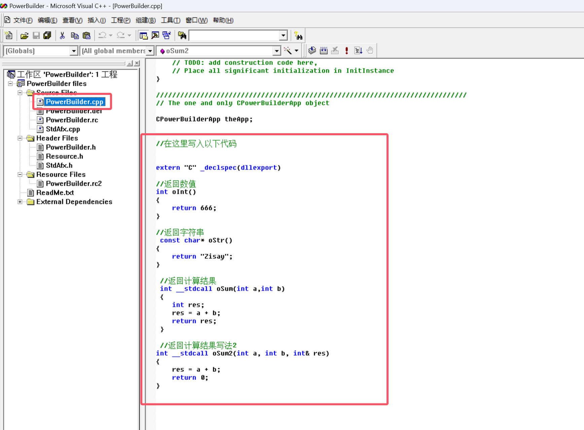
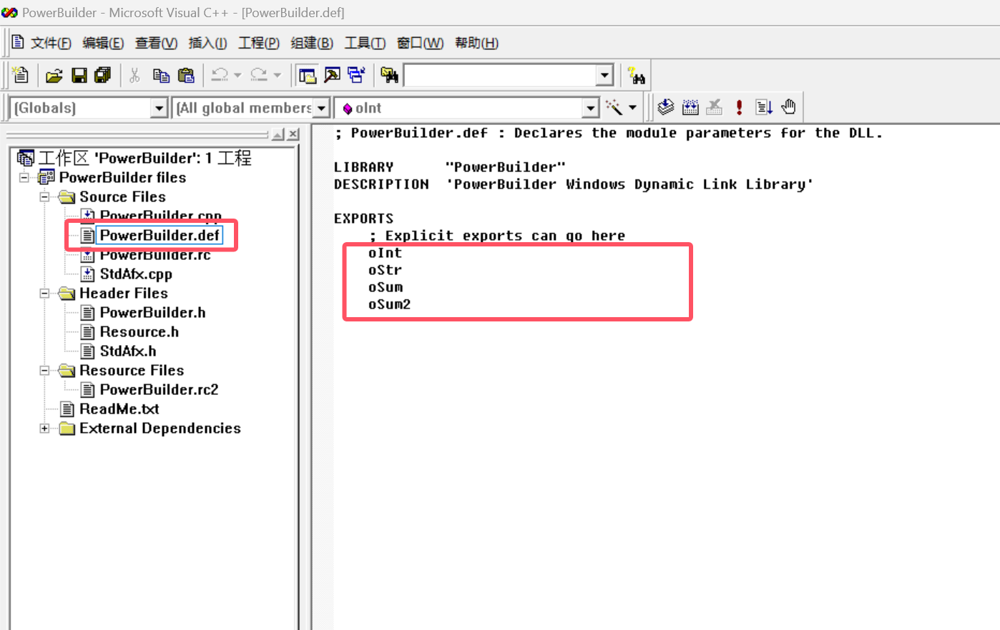
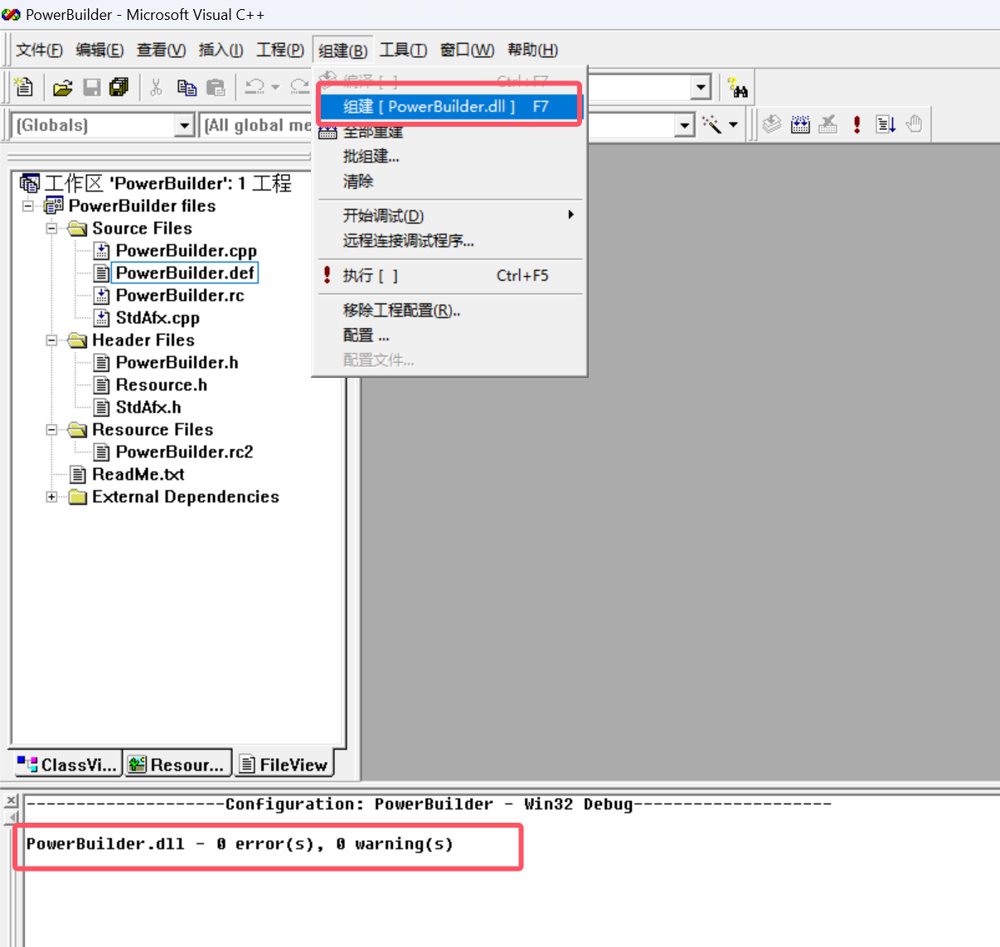

# PB调用C++动态库(DLL) - Vc++6.0

## 1、新建工程


## 2、创建 DLL 的类型


## 3、切换到 FileView 页面


## 4、在 PowerBuilder.cpp 下编写以下代码



```c
//在这里写入以下代码


extern "C" _declspec(dllexport)

//返回数值
int oInt()
{
	return 666;	
}

//返回字符串
 const char* oStr()
{
	return "Zisay";
}

 //返回计算结果
 int __stdcall oSum(int a,int b)
 {	
	int res;
	res = a + b;
	return res;
 }

 //返回计算结果写法2
int __stdcall oSum2(int a, int b, int& res)
{
	res = a + b;
	return 0;
}
```

## 5、在 PowerBuilder.def 定义导出的函数名称



```c
	oInt
	oStr
	oSum
	oSum2
```

## 6、编译

> 注：编译出来的 dll 文件在项目根目录下的 Debug 文件夹



## 7、在 PB 中定义外部动态库


```c
function int oInt()  library "PowerBuilder.dll"  alias for "oInt;ansi"
function string oStr() library "PowerBuilder.dll" alias for "oStr;ansi"
function int oSum(int a,int b) library "PowerBuilder.dll" alias for "oSum;ansi"
function int oSum2(int a,int b,ref int res) library "PowerBuilder.dll" alias for "oSum2;ansi"
```

## 8、调用dll函数

```c
int li_int,li_res
string ls_ostr

li_int = oInt() //调用 oInt 方法
messagebox('提示',' oInt 方法的返回值是：' + string(li_int))

ls_ostr = oStr() //调用 oStr 方法
messagebox('提示',' oStr 方法的返回值是：' + ls_ostr)

li_int = oSum(1,1)
messagebox('提示',' oSum 方法的返回值是：' + string(li_int))

oSum2(1,1,ref li_res)
messagebox('提示',' oSum2 方法的返回值是：' + string(li_res))
```