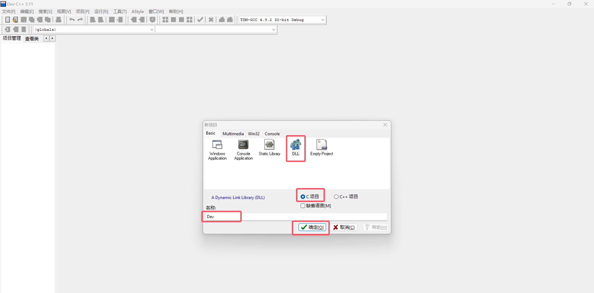
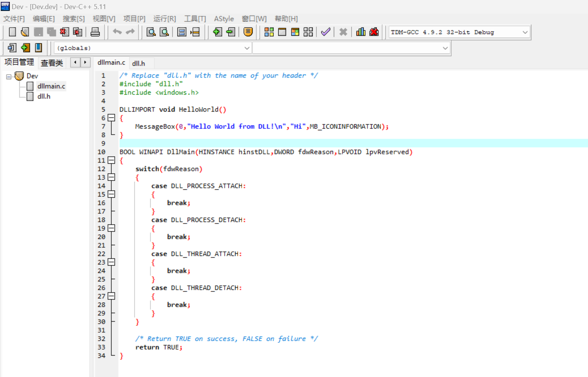
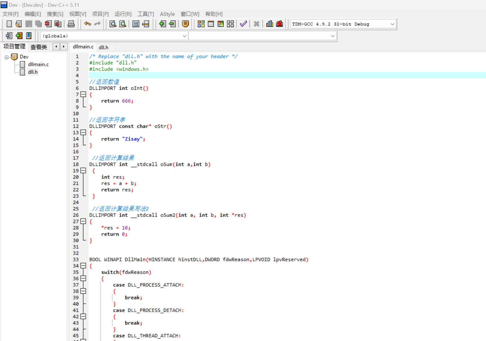
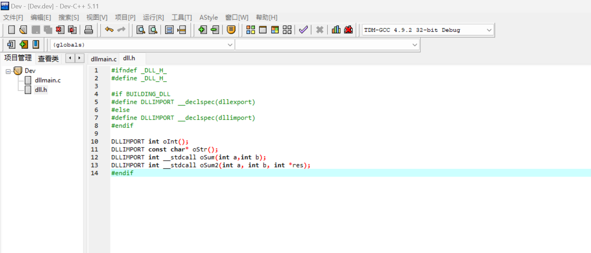
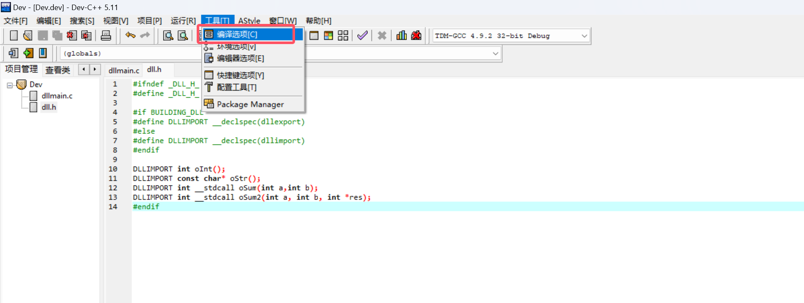
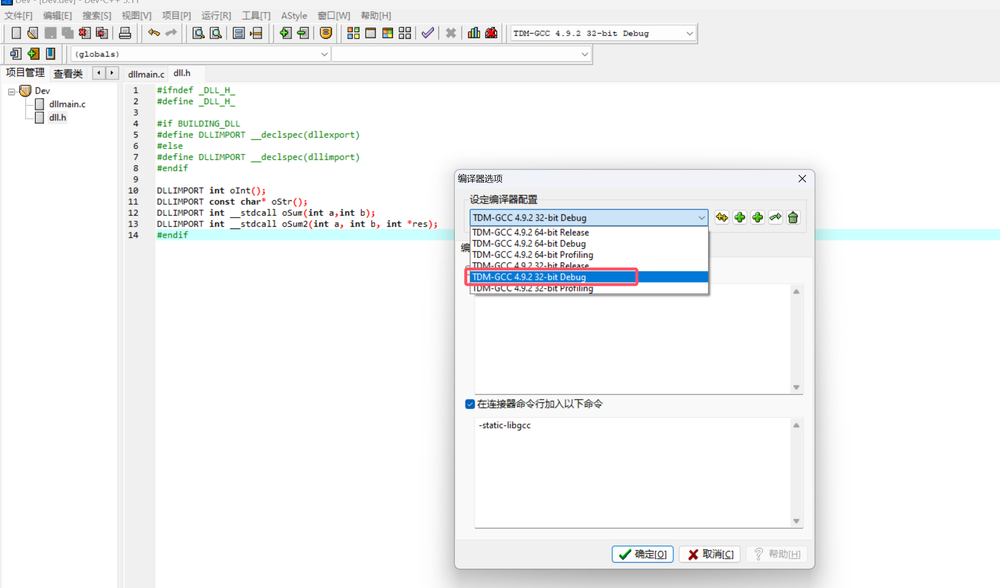
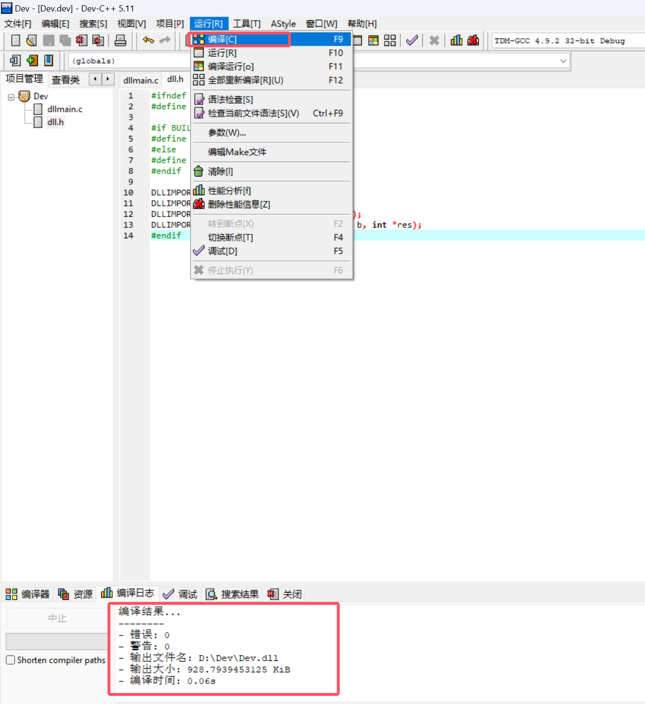
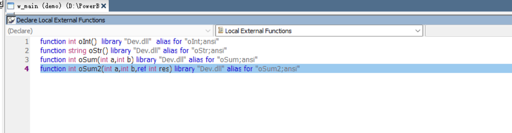

# PB调用C++动态库(DLL) - Dev-C++

## 1、创建项目



创建完成后，会看到这个页面

## 

## 2、在 dllmain.c 文件中，编写以下代码

> 注：可以删除自带的 HelloWorld 方法后再添加



```c
//返回数值
DLLIMPORT int oInt()
{
	return 666;	
}

//返回字符串
DLLIMPORT const char* oStr()
{
	return "Zisay";
}

 //返回计算结果
DLLIMPORT int __stdcall oSum(int a,int b)
 {	
	int res;
	res = a + b;
	return res;
 }

 //返回计算结果写法2
DLLIMPORT int __stdcall oSum2(int a, int b, int *res)
{
	*res = 10;
	return 0;
}
```

## 3、在 dll.h 文件中，编写以下代码



```c
DLLIMPORT int oInt();
DLLIMPORT const char* oStr();
DLLIMPORT int __stdcall oSum(int a,int b);
DLLIMPORT int __stdcall oSum2(int a, int b, int *res);
```

## 4、编译

> 注：编译出来的 dll 文件在项目根目录可以找到







## 5、在 PB 中定义外部动态库



```c
function int oInt()  library "Dev.dll"  alias for "oInt;ansi"
function string oStr() library "Dev.dll" alias for "oStr;ansi"
function int oSum(int a,int b) library "Dev.dll" alias for "oSum;ansi"
function int oSum2(int a,int b,ref int res) library "Dev.dll" alias for "oSum2;ansi"
```

## 6、调用dll函数

```c
int li_int,li_res
string ls_ostr

li_int = oInt() //调用 oInt 方法
messagebox('提示',' oInt 方法的返回值是：' + string(li_int))

ls_ostr = oStr() //调用 oStr 方法
messagebox('提示',' oStr 方法的返回值是：' + ls_ostr)

li_int = oSum(1,1)
messagebox('提示',' oSum 方法的返回值是：' + string(li_int))

oSum2(1,1,ref li_res)
messagebox('提示',' oSum2 方法的返回值是：' + string(li_res))
```

