# PB调用C++动态库(DLL) - Visual Studio

## 1、安装 Visual Studio 2022 社区版

选择【使用 C++ 的桌面开发】，并选择【全部下载后再安装】

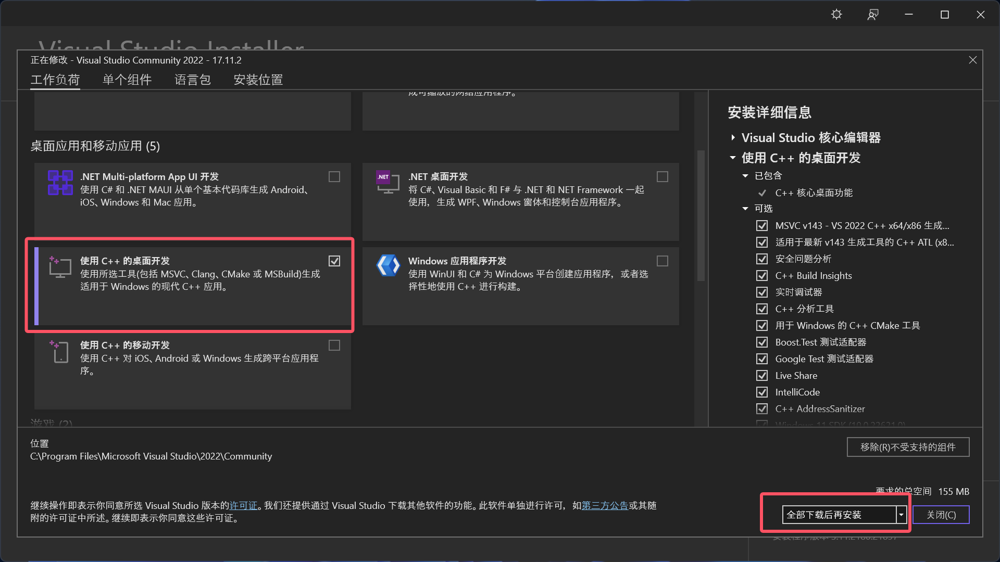

## 2、创建项目

打开 Vs2022 后，点击创建新项目

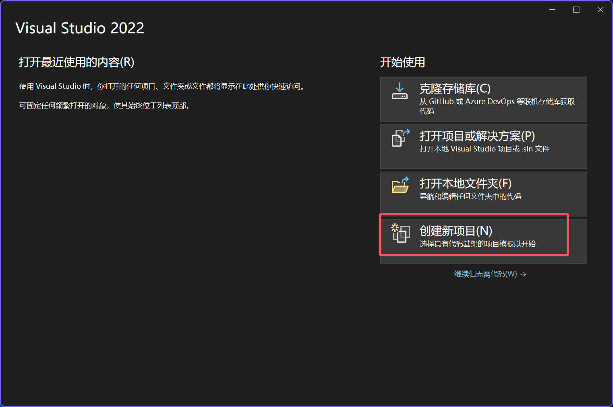

选择 C++ 和 动态链接库，再点击【下一步】

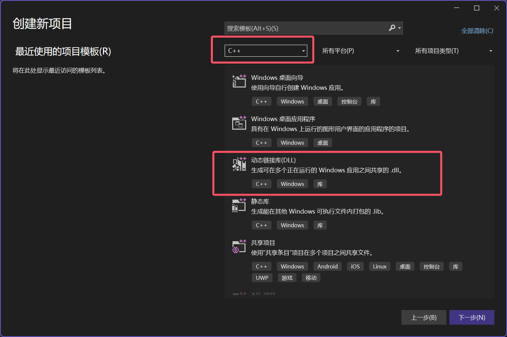

设置项目名称和项目位置（可以参照下图中我的设置）

并勾选【将解决方案和项目放在同一目录中】

最后点击【创建】按钮即可

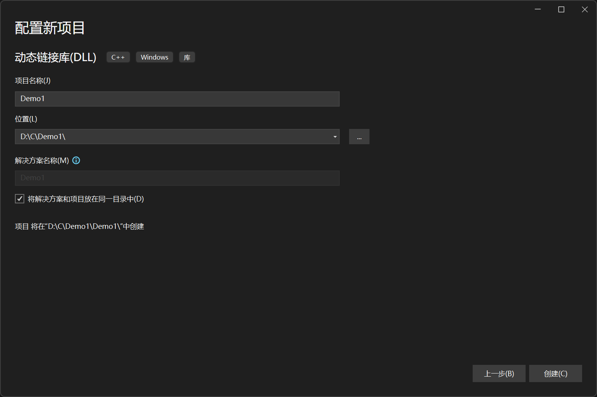

进来后会看到以下页面，下面做个简单的介绍

头文件（.h）：主要用于声明函数、类、常量、宏定义等，将函数和类的声明放在头文件中。

源文件（.cpp）：用于存放程序的具体实现代码。

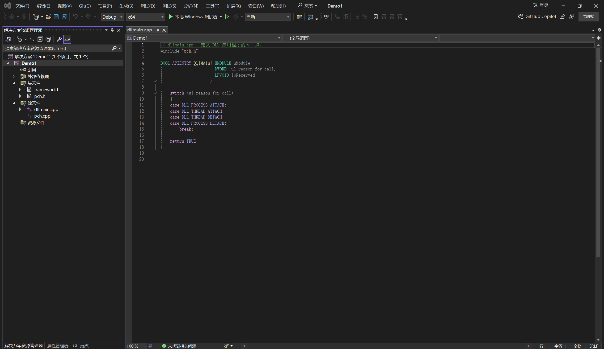

## 3、创建 PowerBuilder.h（头文件）

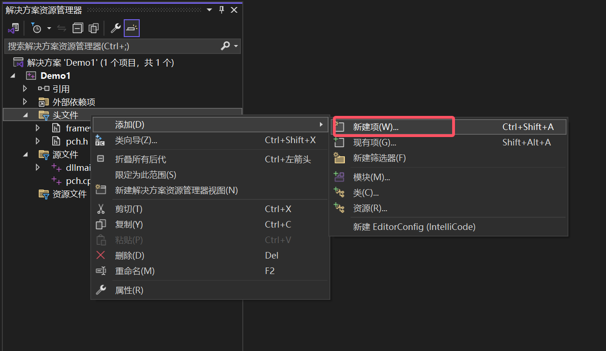

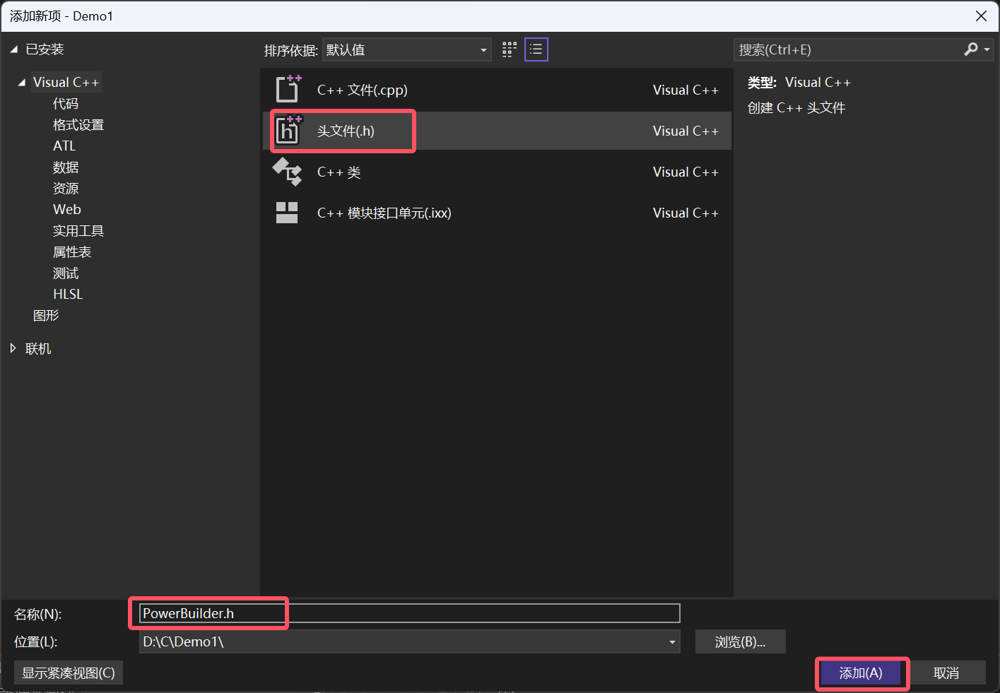

头文件里如果没有特殊的需求，可以什么都不写，空着就好

## 4、创建 PowerBuilder.cpp（源文件）

和创建头文件的方法类似，都是添加项，然后选择 `c++ 文件(.cpp)` 就可以了

powerbuilder.cp 文件内容如下

```c++
#include "pch.h"
#include "framework.h"
#include "PowerBuilder.h"

extern "C" _declspec(dllexport)

//返回数值
int oInt()
{
	return 666;
}

//返回字符串
const char* oStr()
{
	return "Zisay";
}

//返回计算结果
int __stdcall oSum(int a, int b)
{
	int res;
	res = a + b;
	return res;
}

//返回计算结果写法2
int __stdcall oSum2(int a, int b, int& res)
{
	res = a + b;
	return 0;
}
```

## 5、创建 Source.def（模块定义文件）

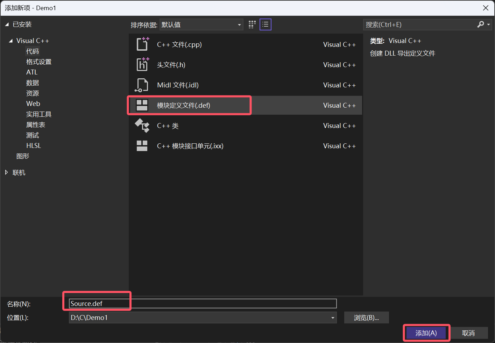

文件内容如下：

```c++
LIBRARY
    EXPORTS  
    oInt
    oStr
    oSum
    oSum2
```

## 6、设置活动平台为 Win32

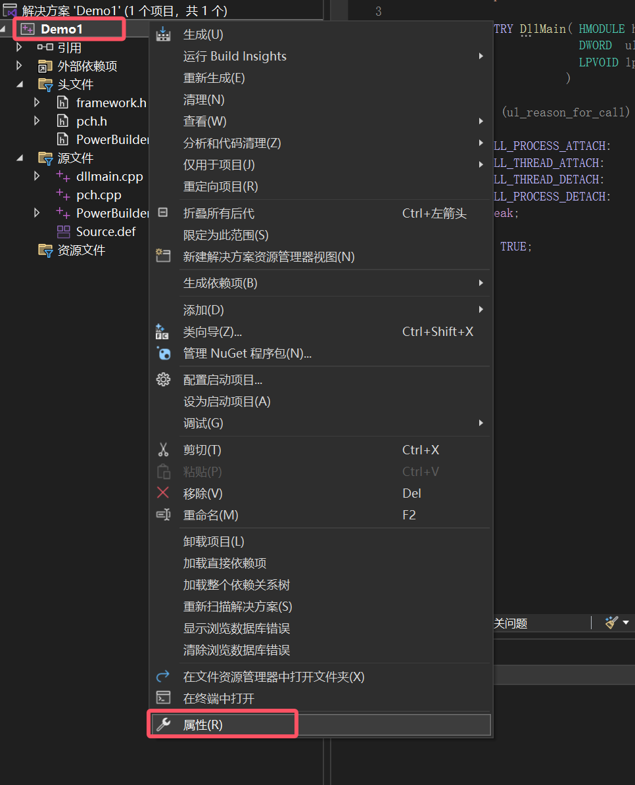

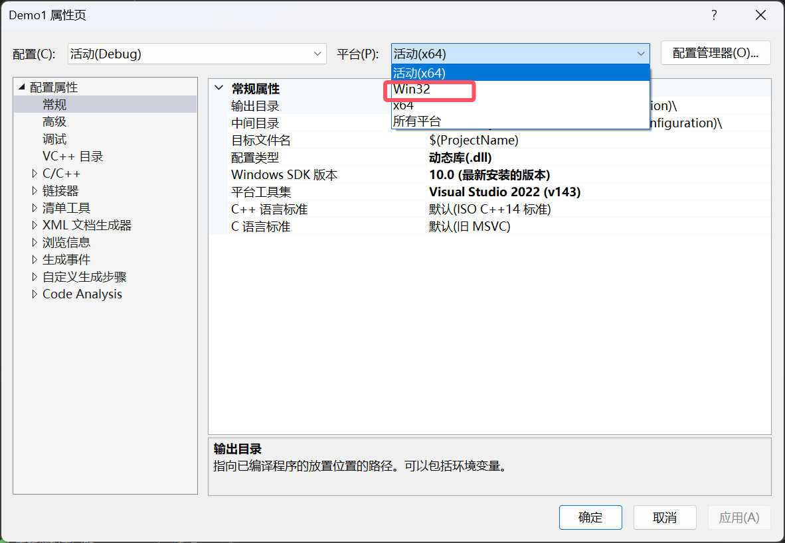

## 7、修改调用约定

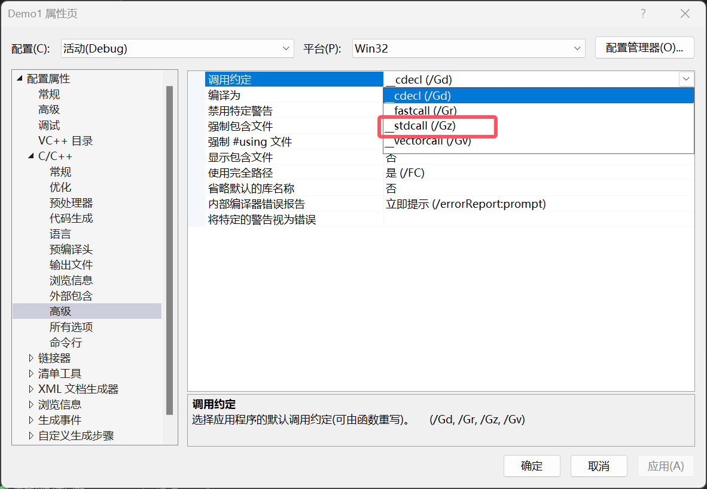

## 8、修改解决方案

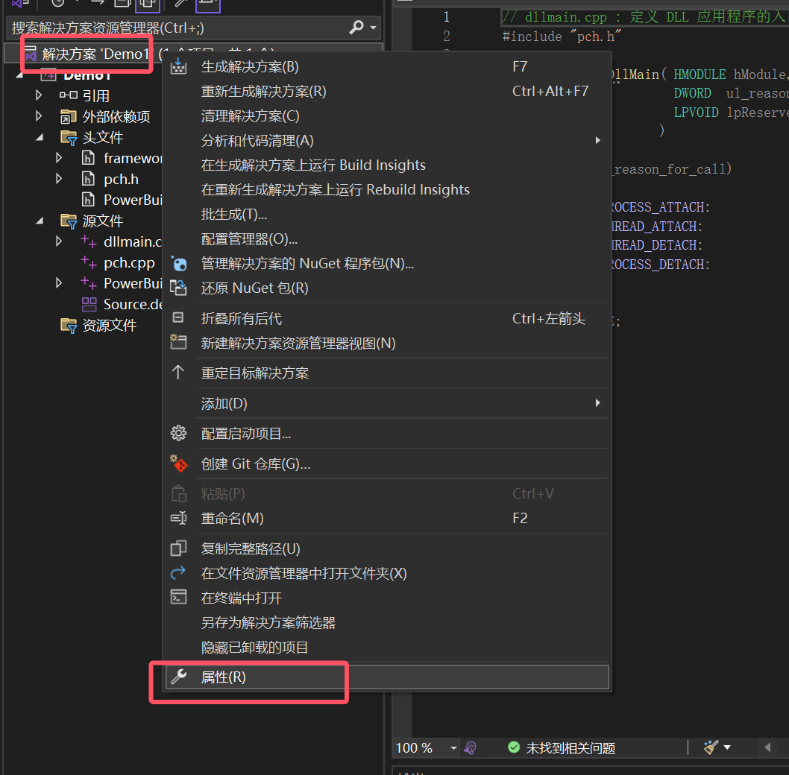

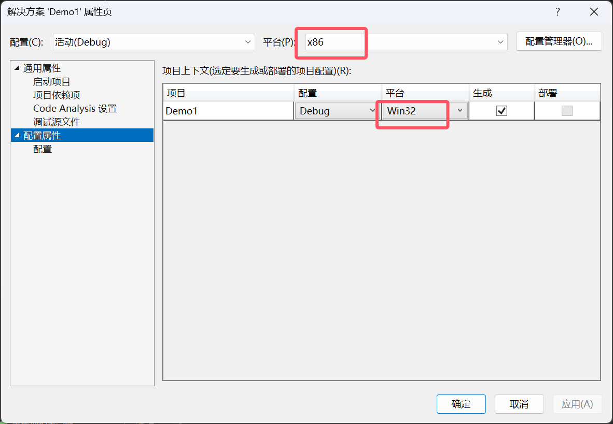

## 9、生成解决方案

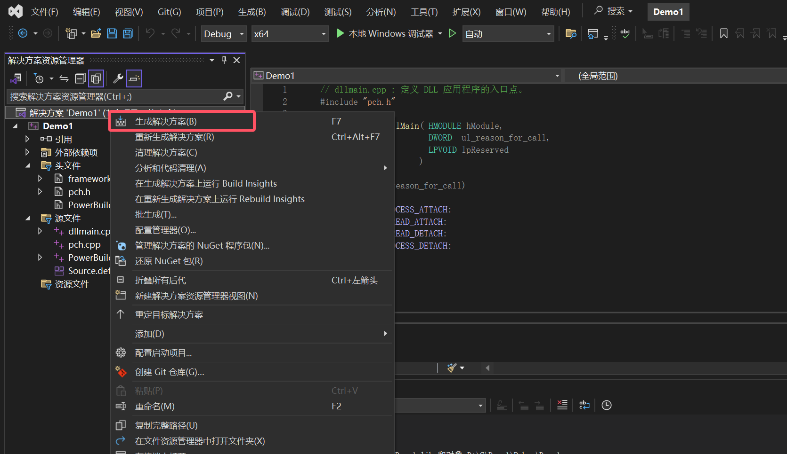

生成解决方案后，来到 D:\C\Demo1\Debug 目录下找到 Demo1.dll 并复制到你的 PB 项目中

## 10、在 PB 中定义外部动态库


```c
function int oInt()  library "demo1.dll"  alias for "oInt;ansi"
function string oStr() library "demo1.dll" alias for "oStr;ansi"
function int oSum(int a,int b) library "demo1.dll" alias for "oSum;ansi"
function int oSum2(int a,int b,ref int res) library "demo1.dll" alias for "oSum2;ansi"
```

## 11、调用dll函数

创建按钮控件，写入以下代码

```c
int li_int,li_res
string ls_ostr

li_int = oInt() //调用 oInt 方法
messagebox('提示',' oInt 方法的返回值是：' + string(li_int))

ls_ostr = oStr() //调用 oStr 方法
messagebox('提示',' oStr 方法的返回值是：' + ls_ostr)

li_int = oSum(1,1)
messagebox('提示',' oSum 方法的返回值是：' + string(li_int))

oSum2(1,1,ref li_res)
messagebox('提示',' oSum2 方法的返回值是：' + string(li_res))
```
